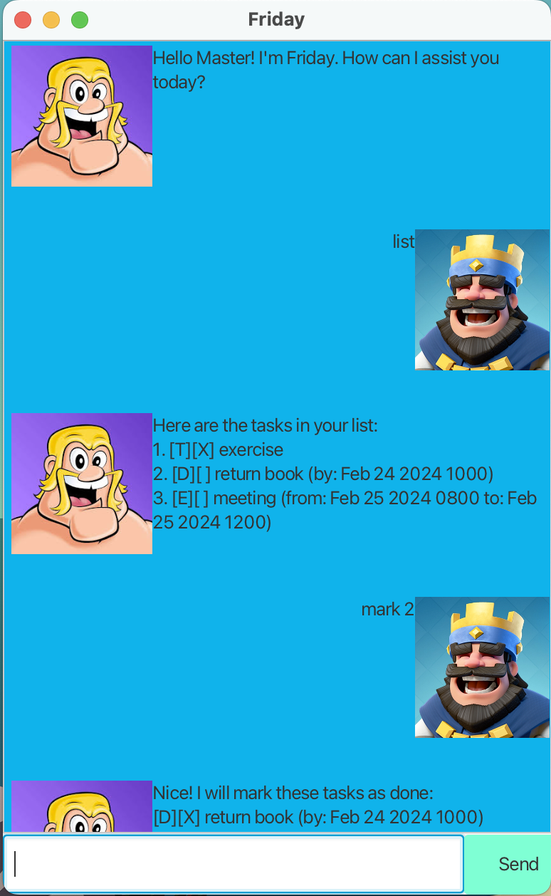

# Friday User Guide



Friday is a text-based task manager. It helps you to track your todos, deadlines, and events.

## Adding todos

You can ask Friday to add to-do tasks.

Todo tasks have no deadlines and no time durations. 

Example: `todo exercises`

The to-do task will be added to the list of tasks. 
[T] shows that the task is a to-do task. 
The second [] shows the status of the to-do. 
If it is done, a [X] will be shown.

```
[T][] exercise
```

## Adding deadlines

You can ask Friday to add deadline tasks.

Deadline tasks have a deadline.

Example: `deadline /by 2024-02-24 1000`

The deadline task will be added to the list of tasks.
[D] shows that the task is a deadline task. 
The second [] shows the status of the task. 
If it is done, a [X] will be shown.

```
[D][] return book (by: Feb 24 2024 1000) 
```

## Adding events

You can ask Friday to add events.

Event tasks have a time duration.

Example: `event /from 2024-02-25 0800 /to 2024-02-25 1200`

The event task will be added to the list of tasks.
[E] shows that the task is an event task.
The second [] shows the status of the task.
If it is done, a [X] will be shown.

```
[E][] meeting (from: Feb 25 2024 0800 to: Feb 25 2024 1200) 
```

## Mark and Unmark

Mark and unmark allows you to mark or unmark a task to done or not done. 
You can mark/unmark multiple tasks as done/not done in one command. 

Example: `mark 1, 2, 3`

This will mark tasks 1, 2, 3 to done. 

Example: `unmark 3, 4, 5`

This will mark task 3, 4, 5 from the task list to not done.

## Delete

This operation deletes the corresponding tasks from the task list. 
You can delete multiple tasks in one command.

Example: `delete 1, 2,3`

This will delete tasks 1, 2, 3 from the task list. 

## List
You can ask Friday to list out the tasks for you. 

Example: `list`

This will show the list of tasks stored in Friday.

## Bye
You can exit Friday by simply typing by in the command box.

Example: `bye`

Friday will greet you first, and then exit on its own. 